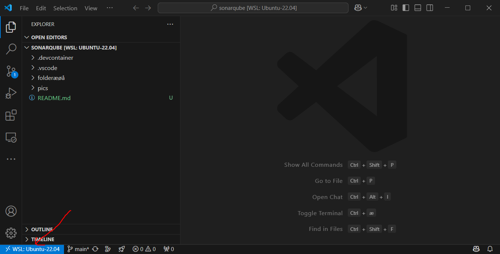
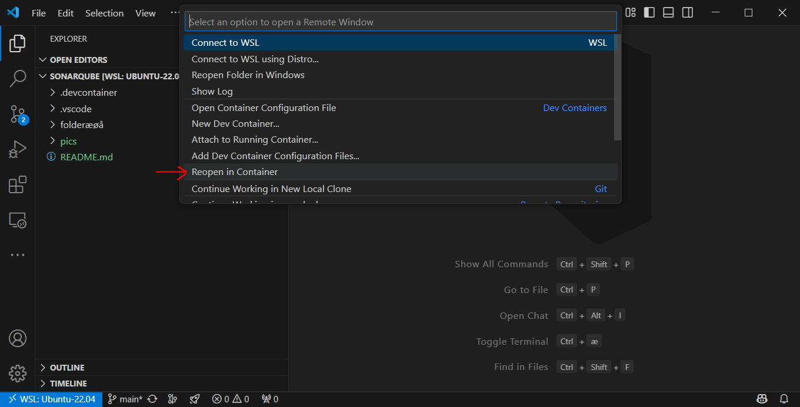
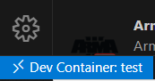
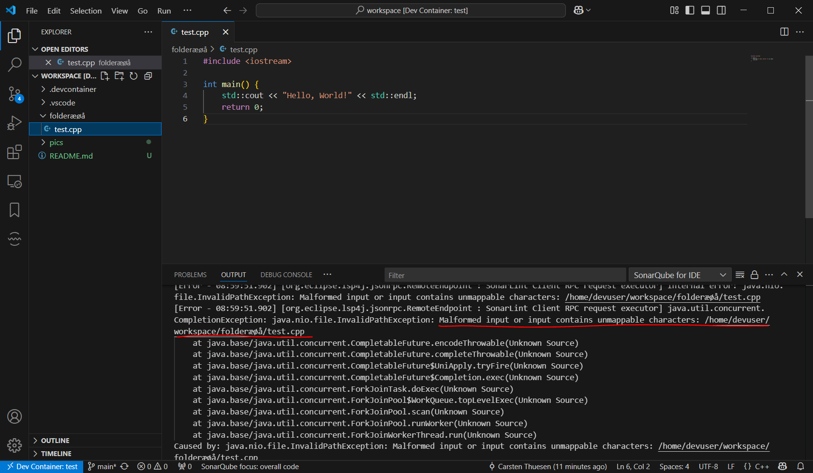

# README

Clone the repo and open it in `vscode`.

Install the `Dev Container` extension: https://marketplace.visualstudio.com/items/?itemName=ms-vscode-remote.remote-containers

Next click the blue button in the lower left corner

Pick the "Reopen in Container"

Now it should build a devcontainer environment.\
When properly setup it should show "Dev Container: test"

In the dev container we get an error message form "SonarQube for IDE" output when opening the file with unicodes in the path.

